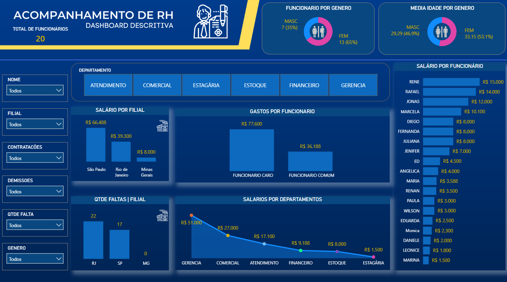

# 👥 Dashboard de Controle de RH — Power BI

## 📋 Sobre o Projeto
Dashboard analítico desenvolvido no **Power BI** para gestão e monitoramento de dados de recursos humanos de uma empresa. O projeto centraliza informações de funcionários, departamentos, contratações, demissões, salários e folha de ponto em um painel interativo com navegação intuitiva, slicers dinâmicos e visuais customizados para análise em tempo real.

---

## 📊 Estrutura do Dashboard
O relatório é composto por **2 páginas**:

### 🏠 Capa
Página de apresentação com identidade visual do projeto e botão de navegação para o dashboard principal.

### 🏠 CONTROLE DE RH
Página principal com visão operacional completa dos dados de pessoal, contendo:

* **Gráfico de Barras** — funcionários por departamento/filial
* **Gráficos de Colunas** — visualizações de contratações, demissões e distribuição salarial
* **Gráfico de Área** — evolução temporal de dados de RH
* **Gráficos Donuts** — distribuição de funcionários por gênero e estado
* **Cards de KPIs:** Total de Contratações, Total de Demissões, Média de Idade, Total em Folha
* **Tabela detalhada** com dados de funcionários: NOME, SEXO/GÊNERO, DEPARTAMENTO, FILIAL, QTDE Faltas, Total Salário, Estados
* **Filtro de busca por funcionário** (visual customizado)
* **Slicers dinâmicos:** FILIAL, DEPARTAMENTO, SEXO/GÊNERO, Estados, Funcionário

---

## 🗄️ Modelagem de Dados

### Tabelas utilizadas
| Tabela | Descrição |
|--------|-----------|
| `tb_rh` | Tabela fato principal — registros de funcionários com dados pessoais, funcionais, salários, faltas e status |

### Principais colunas — `tb_rh`
| Coluna | Tipo | Descrição |
|--------|------|-----------|
| NOME | Texto | Nome do funcionário |
| SEXO / GÊNERO | Texto | Gênero do funcionário |
| DEPARTAMENTO | Texto | Área/Setor de atuação |
| FILIAL | Texto | Unidade/Filial onde trabalha |
| Estados | Texto | Estado de residência |
| Funcionario | Texto | Identificador único do funcionário |
| Total Salario | Numérico | Salário total do funcionário |
| Media Idade | Numérico | Idade média (calculada) |
| QTDE FALTA | Numérico | Quantidade de faltas |
| QTDE Faltas | Numérico | Total de faltas registradas |
| CONTRATACÕES FEITAS | Numérico | Número de contratações realizadas |
| DEMISSOES | Numérico | Número de demissões |

---

## 📐 Medidas e Cálculos DAX

| Medida | Descrição |
|--------|-----------|
| `Total Salario` | Soma total da folha de pagamento |
| `Media Idade` | Idade média dos funcionários |
| `TOTAL CONTRATAÇÕES` | Contagem de contratações realizadas |
| `TOTAL DEMISSÕES` | Contagem de demissões |
| `TOTAL FUNCIONÁRIOS` | Contagem distinta de funcionários |
| `MÉDIA DE FALTAS` | Média de faltas por funcionário |
| `TICKET SALÁRIO MÉDIO` | Salário médio por funcionário |

---

## 🛠️ Tecnologias e Recursos

* **Power BI Desktop**
* **DAX** — medidas e colunas calculadas
* **Power Query (M)** — transformação e tratamento de dados de RH
* Visuais customizados: **Text Filter** (filtro de busca por funcionário)
* Slicers avançados com sincronização entre páginas
* Tema visual customizado (CY26SU02)
* Imagens de fundo por filial/departamento
* Gráficos: Barras, Colunas, Área, Donuts, Cards, Linha+Coluna Combinada

---

## 📊 Principais Análises Possíveis

✅ **Folha de Pagamento** — Visualizar distribuição salarial por departamento e filial  
✅ **Movimentação de Pessoal** — Monitorar contratações e demissões ao longo do tempo  
✅ **Composição do Quadro** — Análise por gênero, idade e localização geográfica  
✅ **Absenteísmo** — Identificar padrões de faltas por departamento e funcionário  
✅ **Comparativo Filial** — Comparar indicadores entre unidades  
✅ **Busca de Funcionário** — Localizar rapidamente informações de um colaborador  

---

## 🚀 Como Visualizar

1. Faça o download do arquivo `RH.pbix`
2. Abra com o **Power BI Desktop** (gratuito — [download aqui](https://powerbi.microsoft.com/pt-br/desktop/))
3. Navegue pelas páginas: **CONTROLE DE RH → Página 2**
4. Utilize os slicers para filtrar por filial, departamento, gênero, estado e funcionário
5. Interaja com os gráficos para drill-down e análises detalhadas

---

## 💡 Diferenciais do Projeto

🎨 **Design responsivo** com layout intuitivo e paleta de cores profissional  
🔍 **Busca por funcionário** integrada para acesso rápido a informações  
📊 **Múltiplas perspectivas** — operacional, analítica e comparativa  
⚡ **Performance otimizada** com cálculos DAX eficientes  
🔗 **Relacionamentos bem modelados** para análises confiáveis  

---

## 👨‍💻 Autor
Feito com 💙 por **Juan Almeida**

---

## 📝 Notas

* Projeto desenvolvido com dados fictícios para fins educacionais
* Modelo de dados preparado para fácil integração com fontes reais
* Dashboard pronto para adaptação a diferentes estruturas organizacionais
* Suporta atualizações automáticas de dados via conexão dinâmica
